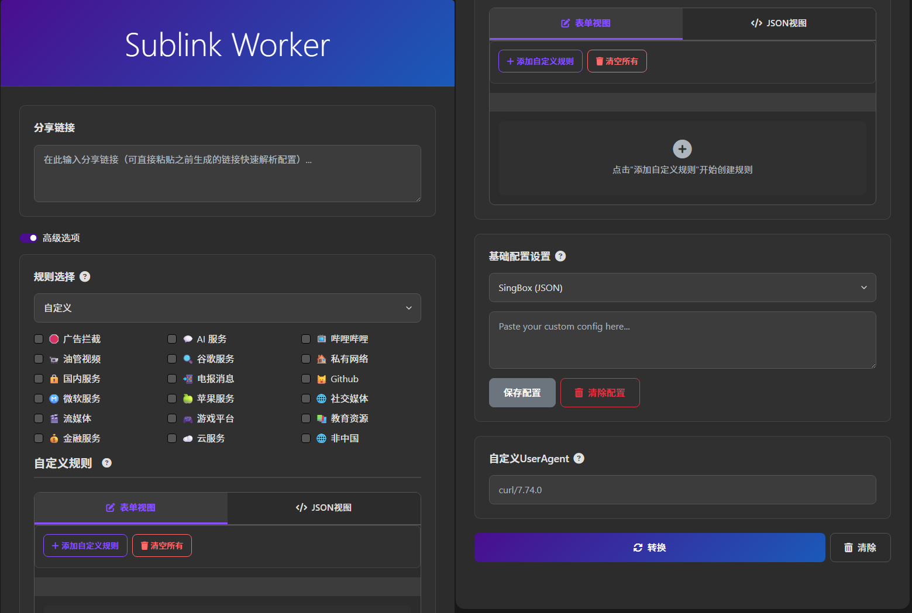

<p align="center">
  
</p>

<p align="center">
  <a href="https://github.com/xiaoqiangclub/sublink-worker/stargazers"></a>
  <a href="https://github.com/xiaoqiangclub/sublink-worker/issues"></a>
  <a href="https://github.com/xiaoqiangclub/sublink-worker/blob/main/LICENSE"></a>
  
  
</p>

# Sublink Worker (本地化 & Docker化版本)

本项目基于 [7Sageer/sublink-worker](https://github.com/7Sageer/sublink-worker) 项目进行了深度修改和重构。

本次修改的主要目的是为了提供**本地化部署**和 **Docker/Docker Compose** 支持，方便那些希望在自己的服务器或本地环境中运行此服务的用户。

---

## ✨ 功能特性

<p align="center">
  
</p>

本项目完整保留了原项目的所有核心功能：

-   **多种格式转换**：支持将订阅链接转换为 Xray, SingBox, Clash, Surge 等多种客户端兼容的格式。
-   **灵活的规则集**：内置多种预设规则集（最小化、均衡、全面），并支持高度自定义的路由规则。
-   **前端操作界面**：提供一个直观的前端页面，方便用户输入链接、选择规则并生成转换后的订阅。
-   **短链接服务**：支持将长订阅链接缩短，方便分享和使用。

## 🚀 快速开始

您可以通过以下几种方式在本地环境中启动本项目。

### 1. 使用 Docker Compose (生产推荐)

这是最简单、最推荐的部署方式，它将直接从 Docker Hub 拉取预构建好的镜像来运行。

**环境要求:**
- [Docker](https://www.docker.com/)
- [Docker Compose](https://docs.docker.com/compose/)

**步骤:**

1.  下载本仓库中的 `docker-compose.prod.yml` 文件。
2.  在该文件所在目录，执行以下命令：

    ```bash
    docker-compose -f docker-compose.prod.yml up -d
    ```

服务将在后台启动。您可以通过浏览器访问 `http://localhost:3000` 来使用。

要停止服务，请执行：
```bash
docker-compose -f docker-compose.prod.yml down
```

### 2. 本地直接运行 (开发推荐)

**环境要求:**
- [Node.js](https://nodejs.org/) (推荐 v20.x 或更高版本)
- [pnpm](https://pnpm.io/)

**步骤:**

1.  **克隆仓库**
    ```bash
    git clone https://github.com/xiaoqiangclub/sublink-worker.git
    cd sublink-worker
    ```

2.  **安装依赖**
    ```bash
    pnpm install
    ```

3.  **启动服务**
    -   **开发模式** (文件修改后会自动重启):
        ```bash
        pnpm dev
        ```
    -   **生产模式**:
        ```bash
        pnpm start
        ```

服务启动后，您可以通过浏览器访问 `http://localhost:3000`。

### 3. 使用 Docker (手动构建)

如果您希望自行构建镜像。

**环境要求:**
- [Docker](https://www.docker.com/)

**步骤:**

1.  **构建 Docker 镜像**
    ```bash
    docker build -t xiaoqiangclub/sublink-worker .
    ```

2.  **运行 Docker 容器**
    ```bash
    docker run -d -p 3000:3000 --name sublink-worker --restart always xiaoqiangclub/sublink-worker
    ```

## 📝 使用说明

-   **访问地址**：无论使用哪种方式部署，服务的默认访问地址都是 `http://localhost:3000`。
-   **账号和密码**：本项目是一个开放的工具服务，**没有任何内置的账号或密码验证机制**。请确保您的服务运行在安全可信的网络环境中，或自行添加身份验证层。

## 鸣谢

-   特别感谢原项目 [7Sageer/sublink-worker](https://github.com/7Sageer/sublink-worker) 的作者 **7Sageer**，没有他的出色工作，就没有这个本地化版本。

## ☕ 打赏

如果这个项目对您有帮助，欢迎通过以下方式请我喝杯咖啡！

<p align="center">
  
</p>